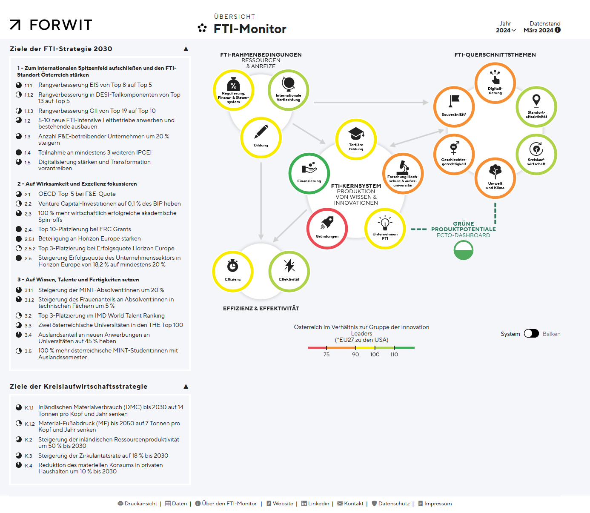
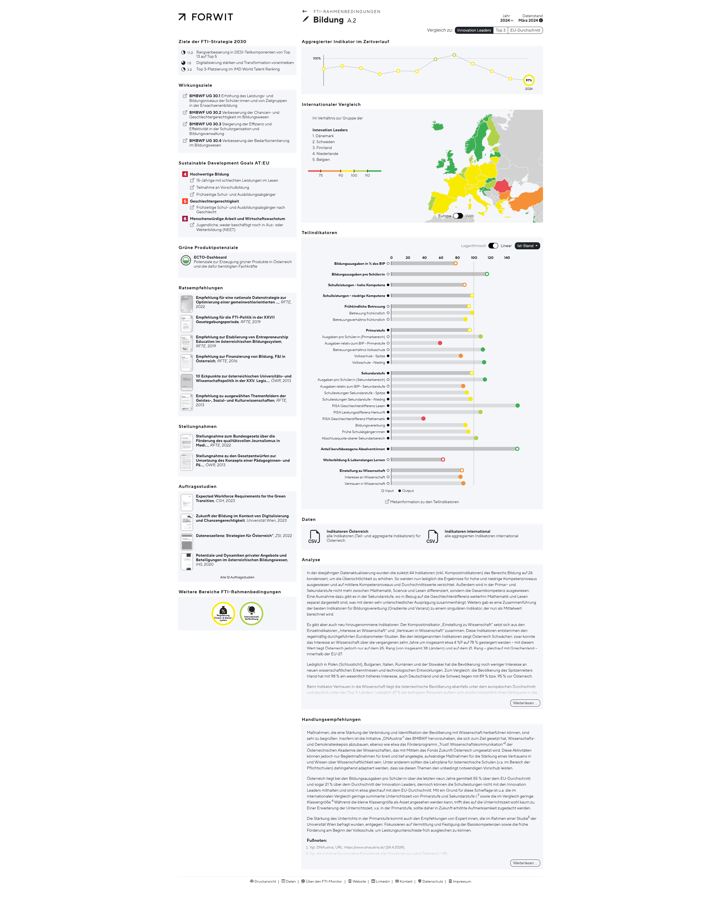
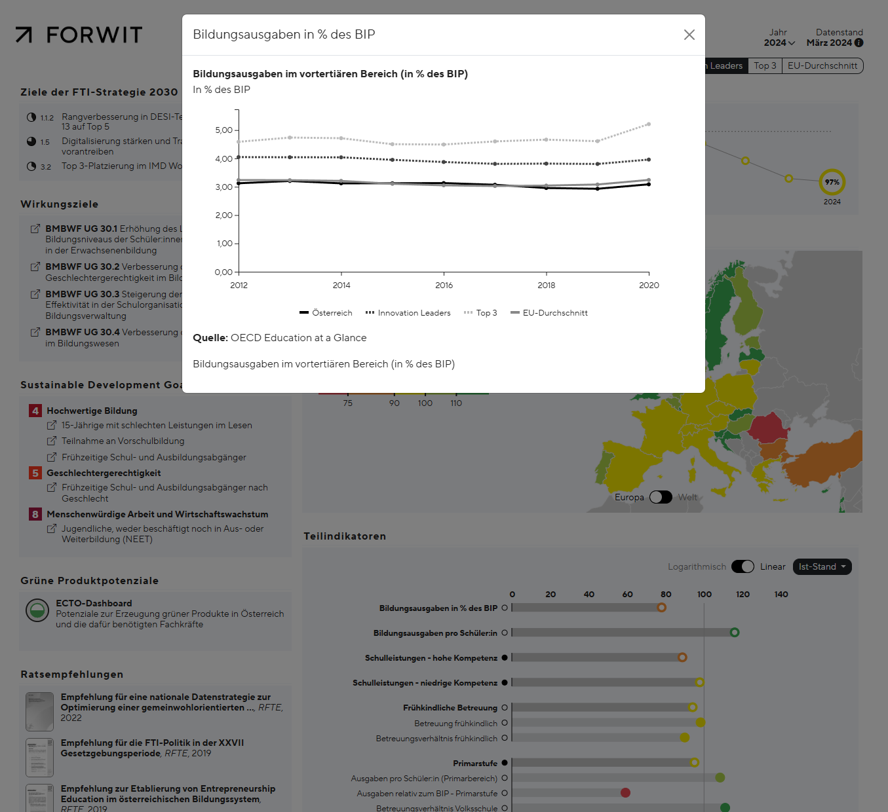

# <!--fit--> Improving usability for the FTI-Monitor

    
    

---

# FTI-Monitor

 + Dashboard made by FORWIT
 + Science - Technology - Innovation
 + Overview of Austria's situation
 + Scored topics
 + Strategic Goals

---

# FTI-Monitor - Topic

 + Some points about topics....

---

# FTI-Monitor - Indicator

Maybe move to challanges???

 + Indicators

---

# FTI-Monitor - Showcase

Show some stuff about the monitor

<a href="https://fti-monitor.forwit.at/O/system">FTI Monitor link</a>

---

# Challanges to be addressed

+ Improve usability
+ Make it easier for new users
+ Add more context for users
+ ...

---

# Goals - Indicator Overview

Indicator overview ...

 --- add mock-up image

---

# Goals - Indicator Details Page

Indicator details page...

 --- add mock-up image

---

# Goals - Indicator Documents Link

Link Documents to Indicators ...

 --- same mock-up image

---

# Indicator compare page page

Talk about implementation

 --- add implemented image

---

# Indicator details page

Talk about implementation

 --- add implemented image

---

# Search algorithms

Searches tried:
 + Text
    + ...
 + LLM
    + ...

---

# <!---fit---> Live   showcase
